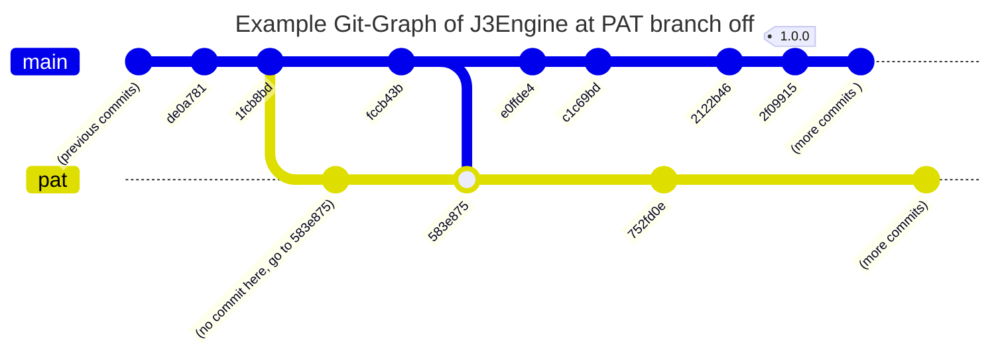

# Pre-PAT branch off

> For context, the PAT branch and the main branch are almost identical in code, however from v1 onwards they differ so the following and
alot more other features are within both: (i cant list all since i didnt keep a changelog, but its alot)

> The main branch itself used to be the PAT.

This has a lot of things from the over a year of dev so like yeah ill briefly mention

* Properties panel to viewe and edit the properties of objects
* Grid2DPanel to draft 2d construction in a 3d plane
* Commands (More so tools) which feature:

  * transform command with scale, rotate, translate and quick-translate
  * camera command with info subcommands and orbit
  * measure command
  * extrude
  * join
  * create
  * prism
  * help
  * explode
  * engine
  * etc...
* Documentation in-app parsed from readable markdown that can either be opened in the app or within any other standard markdown reader (with some quirks)
* Tutorial/Guide
* Projects frame to make a new project, start the tutorial, pin recent projects or the debug project
* context menu in the engine frame itself with some quick commands
* refactor toolbox to include some stats about your CPU
* make all (for the most part) colouring be consistent with J3Engine themes
* persistant user settings
* command hints and suggestions along with right click autocomplete
* menu bar with some quick actions
* make logging a lot more verbose
* Refactor old implementation of GObject drawing itself to instead compose of other smaller geometry that's completely detached from the GObject machinery
* fix a lot of command palette flashing bugs and UI tearing (I blame swing)
* and a lot more of core J3Engine.

# v1.0.0

* Refactor a lot of stuff to use jar resources stream
* Completely purge all database related IO
* Remove all mention of a user table or remembered user 
* Refactored themes to not be database backed anymore as PAT chains have been relinquished.
  * Engine defaults are an enum and themes have specialised classes
  * Users can now define custom J3Engine themes that persist on disk
* Remove Signup/Login and all auth stuff since we are released from the shackles that is the PAT
* Refactored Main from its old Login frame stuff to be an actual Main class

# v1.1.0

* .msi build with all windows configuration as an app and project file stuff so you can access easily without having to run the shaded jar (shaded jar is still included)
* Fix bug where copy/paste revealed GPoint's equals was not really an equals
* Add curve support to properties filter as it was supposed to
* Add main startup with a project file for msi support. basically skips the entire projects frame opening and immediately goes to splash text
* fix some theme changer stuff not working
* begin back integrated Jaiva! because why not

# v1.2.0 Macros!

* Change `.msi` build to be per user (as the J3Engine user files are per-user too)
* Add Custom keybind utility dialog since swing doesn't have one for some odd reason
* Add Macros which record (almost) all user input to replay via keybind
  * Added a main `macro` command with a `record`, `run`, `end` and `list` subcommands.
  * Added macros menu to the settings menu which manages macros' keybinds (although you can quick access the menu via the menu bar using the ALT+M accelator)
  * Macros persist on disk and can be key-bound to any key which J3Engine does not use already for global keys or accelerators
* Add Error Dialogue to better allow describing errors and linking to the log output when the engine closes (optional) (not implemented yet)
* Make SemiStatefulCommand responsible for firing the StatefulCommandFinished event so even commands which aren't fully stateful still emit the event when they release said state
  * Fix bug where some stateful commands may not release keys if another was run in quick succession. (One shot key order change)
  * Removed unused ActionEvent from all implementations. I seriously dont know why it was even in the methods like it was NEVER used.
  * Further make all implementors of KeyedStatefulCommand instead fire events only after they have confirmed stateliness release
* Change ordering of one shot J3Keys. They are now removed from the keybinds then their callbacks are called.
* Fix bug where when a project file fails to load the splash text shows up on top of the error message
* update selection event payload to include the coordinates of the cursor to make the selection rectangle
* Make Camera participate in events by firing its own event when it updates
* Trying to save an empty project now alerts the user that they are saving absolute jack shit
* Continue JavaDoc stuff for completeness
* Remove dangling PAT error codes (see PAt branch)
* Added new Camera Movement event payload with it's event type. Currently only macros consume but any listener can now listen for camera changes.
  * Movement keys `W`, `A`, `S`, `D`, `Q` and `E` use a new specialised method which does not emit an event. Only when the key is explicit released does it recall the normal method which does emit an event. Allowing long key presses to only emit a single event
* Added Github workflow to publish JavaDoc site with all public, private, protected and package-private classes, fields and methods to github pages cuz why not
* Removed unused background music from resources. Cluttering build
* Change `jaiva` import to be of the released github version such as to allow JavaDoc to build and not the locally installed version.

# v1.3.0 Grid2d

* Fix bug where curves could not be moved in point/tri mode
* Change `ConversionProperties` to be `Conversion` and add `ConversionWithOffset` and an `Offset` class for converting between `ScreenPoint` and `CartesianPoint`
* Grid2dPanel updates
  * Grid2dPanel now uses `ConversionWithOffset` such as to allow panning the canvas
  * Grid2dPanel has been split into `Grid2dPanel` and `GridManager` to alleviate responsibilities off of `Grid2dPanel`
  * Grid2dPanel now allows panning the canvas (using any mouse button that isnt LEFT click)
  * the X and Y vectors are now drawn at the centre to visualize the scaling of the actual plane in 3d