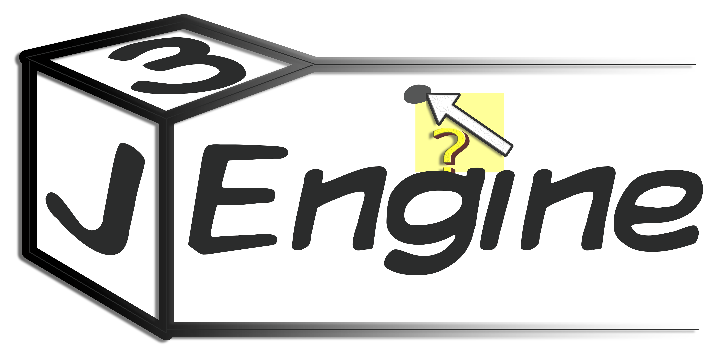

# J3Engine

</img>


A 3D Graphics Engine written in Java from scratch using only 
the Java Standard Library and [Swing](https://docs.oracle.com/en/java/javase/21/docs/api/java.desktop/javax/swing/package-summary.html)'s 
2D drawing capabilities.

This is a project for my 2026 Matric Practical Assessment Task in IT.

(You're in the PAT branch)

# Building and Running J3Engine

## Requirements

- Java 21 or newer
- Maven 3.8+ (or an IDE with Maven support)

## Build

Clone the repository:

```sh
git clone <repository-url>
cd Jaiva3dEngine
```

Switch to the PAT branch:

```sh
git checkout pat
```

Build the project using Maven:

```
mvn clean package
```

This will compile the project and create the packaged JAR in the `target/` directory.

## Run

Run the generated JAR:

```
java -jar target/<jar-name>.jar
```

Alternatively, the project can be opened in an IDE such as IntelliJ IDEA or NetBeans and run through the IDE. (it should be, thats what the PAT required.)

The PAT branch includes the required database file, so no additional database setup is required.

## Notes

The `pat` branch represents the version of J3Engine submitted for the 2026 PAT. It is intended to be a reproducible snapshot of the submitted project.