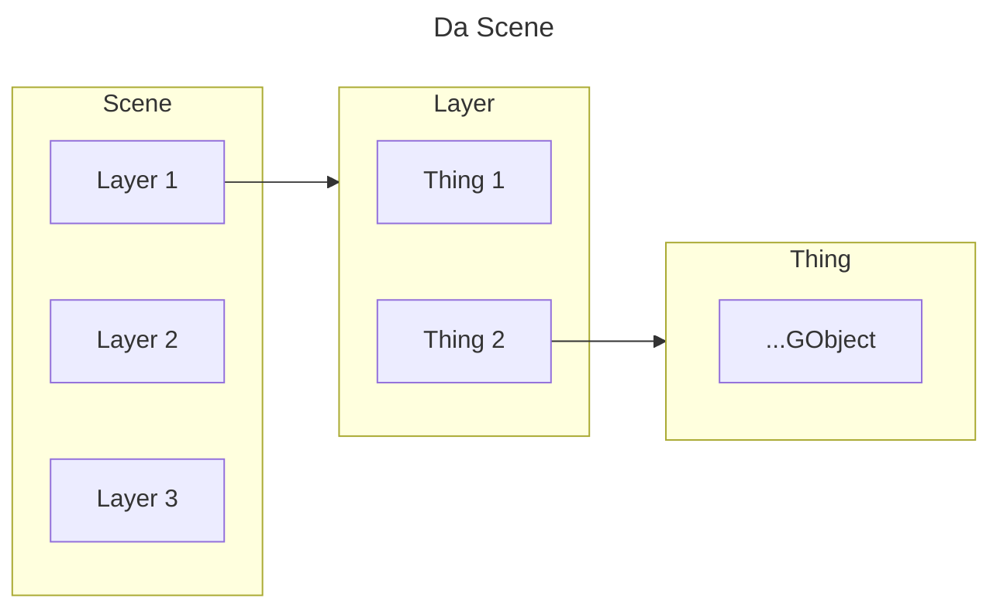

# J3Engine

J3Engine is mostly multiple different distributed sub systems which all work
together in harmony to draw a triangle.

## Inspirations and Motivations

### Commands as Tools (CAD)

> UI, Context Menus, Menu Bars, Macros, whatever user facing action, should where possible
> be a command the user can type into the command palette to execute the exact same logical flow.

No secret UI vs Command Palette command, The command itselfis canonically a `Command` which is 
intended to be ran via the Command Palette, however UI can also invoke any command via the
command palette for the user (beyond injecting positional arguments)
effectively making a single output have multiple ways of giving input. Whether it be:
- A UI button to apply a camera movement
- A method to close the engine
- Whatever the hell else

### Open book philosophy

> If, an internal such as a vector representing a plane direction is to be used, it's best
> it also be represented to the user. No matter how impractical it is, it may be of practical use
> to them to play around with and learn the maths or otherwise.

The purpose, is purely educational. I barely knew linear algebra writing this engine
and I doubt a casual github repository explorer would either, so J3Engine tries its best to
expose it, so you can see what really happens when this input changes or how a perfect value
affects projection.

in the same sense, I avoided reaching for stuff such as `Matrix4` or Homogenous Coordinates
such that the API is explicit in the transformations and maths that get applied.

## Engine Internals

The "engine" itself is just mostly the accumulation of the distributed systems.

### Locating Instances

Most if not majority of classes call upon `StaticRefs` which is a global-static
service-locator. And i am aware this is abd practice and hard to refactor but this is
a single window app and i dont intend on changing it.

`StaticRefs` and `StaticConfig` are here to stay.

### Events

Unlike your usual event emitter and listeners with a "bus", J3Engine uses a more direction approach where:

`Foo` extends `EventEmitter`

`Foo` may decide any time to `broadcast()` an `EventType.FOO_UPDATED` event, with a payload class of `FooUpdatedPayloadEvent`

`Bar` implements `EventListener`

`Bar` attaches itself to a `Foo` instance to listen to.

`Bar` handles `EventType.FOO_UPDATED` in it's `onEvent()` contract

This gives the listeners the reliability of knowing exactly what they are listening for
and where. `Foo` the emitter, is the one which holds all the listeners to `broadcast()` it's events
to, meaning `Bar` needs to call `Foo.attachListener()` 

Events are more so domain specific and not general "engine" events, examples include:

- `COMMAND_FIRED` : A command was fired. It may have exited early or possibly failed to succeed, but it was fired
- `SETTINGS_CODE_UPDATED` : An event primarily used by Settings' panel classes such as to listen
for when the engine changes a setting and the panel such as a panel with a JSpinner needs to update.
- `GPOINT_RECALC_PIVOT` : An event fired by `GPoint`s to broadcast to any geometry dependent on it
that it has moved.

The only real caveat of this, is that you have to know `Foo` before hand. As in you must know
the class and the instance of that class that will fire a specific event.

### Actions

Most commands or property updating, can be undone and this is done by storing mainly 2 things:
- How to `undo` the state
- How to `redo` the state, although this is labelled `run()`

Which is, an `Action`. An interface usually implemented at the call site such that a delta
can be stored directly.

The base interface provides:
- `undo()`, `run()`, `getTime()`, `description()`, `isReversable()`

`Action`s in J3Engine come in different flavours, `DirtyAction`, `VoidAction`, `CleanableAction`,
etc. Mostly for the purpose of having a history the user can undo and redo.

However, before commiting to `History` all Actions' `run()` are to be called right before
commiting, as History will commit the action as having already been run.

The general flow is:
```
foo = new Action<T>{...}
foo.run();
History.add(foo);
```

Mostly old implementations already make heavy use of actions, but it might be visible to see
some newer implementations directly add/commit to geometry updates without making it reversible
or even outright documenting how it cannot be an `Aciton`

### Maths

being hand-rolled we obviously have to define a lot, but J3Engine has a lot of semantics

- `BasePoint<T extends Number>` : A simple point class which stores an `x` and a `y` value
    - `ScreenPoint` : A point, where `(0, 0)` is defined as the **top-left** corner of the screen.
      It's a specialisation of `BasePoint` for storing pixel (Integer) values. (Similar to `java.awt.Point`)
    - `CartesianPoint` : A point, where `(0, 0)`  is defined as the **middle of a given Cartesian space**. It's a
      specialisation of `BasePoint` where it instead stores Double values.

> `CartesianPoint` can be converted to a `ScreenPoint` by providing a _`scale`_ and _`screenSize`_ dimensions, and
vice versa, although converting `ScreenPoint` to a `CartesianPoint` looses precision.

- `MatrixInterface` : Provides a generic matrix interface that can be of any row amount
and column amount
  - `Matrix3` : A Square 3x3 Matrix, primarily used in `Rotation` and it's specialised classes
    for rotation matrices
  - `Vector3` : A 3 component vector of `x`, `y`, `z` which also 
  happens to be a usable as a 3x1 column matrix. It is the fundamental unit of the entire
  maths part of the engine as it can represent: A direction, A position, An axis, A delta,
  A transformation or something else that it probably shouldn't be. Context.

> Projection uses standard Perspective Projection via Camera rotation angles and the subtraction
> thing. `Vector3` is projected onto the screen and hence represented on the screen as a `CartesianPoint`
> although thats the intermediate representation before actually drawing it.

- `AxisPlane` : A plane defined by an `origin`, a `v1` and `v2` vectors. Primarily used for creating
procedural geometry or n-gons. See [Prism Command](../src/main/java/com/j3d/engine/interact/cmd/commands/PrismCmd.java)
or more specifically [Solids](../src/main/java/com/j3d/engine/scene/nodes/util/Solids.java)
- `NormalPlane` : A plane defined by an `origin` and a `normal` vector pointing away from the plane.
> AxisPlane and NormalPlane cna be converted between each other. And currently i barely use `NormalPlane`

and other math things but those are really the most important

## Scene

The scene is obviously a hierarchical structure.

Each Object which can participate in the scene implements the `SceneObject` interface
or inherits it via `SceneObjectList`

- The scene at the top is composed of a list of `Layer`s. `Layer`s currently don't serve much
other than sorting multiple objects. (See [Rendering](#rendering))
- A single `Layer`, contains multiple `Thing`s, which is a collection of smaller geometry to make
a composite... thing. It can be a solid meaning it's confirmed to be a closed volume surface
- A single `Thing`, contains multiple `GObject`s. A `GObject` is the base class for the following:
  - `GPoint` : A point. Honestly i think this needs its own section because, most if not all 
  transformations are applied to a `GPoint`'s `Vector3` position. Applying a change to anything
  almost certainly means finding it's constituent `GPoint`. It even emits [Events](#events) to alert
  geometry which may reference it
  - `GLine` : a line which references 2 start and end points.
  - `GCurve` : A Bézier curve from 3 points. It references 3 GPoint(s)
  - `GTri` : A triangle which references 3 lines which close the shape, and the 3 points in order
  to define the winding direction.



Future things such as a `GPolygon` or `GPolyLine` may come to fruition sooner or later.

## UI

TODO

## Rendering

All implementors of `GObject` are not directly drawn themselves. They each are instead **decomposed**
into even smaller geometry types, called _**pure**_ geometry that the **SceneRenderer** sorts using the current selected
method of choice.

To be specific: (Using Graphics2d)

- `GObject` decomposes into a single `Point`, which is drawn as an oval.
- `GLine` decomposes into a single `Segment`, which is drawn as a line between it's 2 end points
- `GCurve` decomposes into multiple tessellated `Segment`s. The amount depends on the property
the instance holds.
- `GTri` decomposes into a single `Triangle` which is drawn as a 3 point polygon

Further more, the Renderer is actually only called through `Thing.draw()`, where `Thing` calls
the methods to return pure geometry and pass it to the `SceneRenderer` to draw every time the
entire list of Layers.draw() is called.

So far, on my i3, no performance drops even at 10k triangles but i know this isnt good.

This also does mean that, if your `GObject` does not live within a `Thing`, it will never be drawn
and will technically be non-existant to you, the user.

> [!NOTE]
> This does mean that, technically Thing and Layer cannot enforce ordering since the `SceneRenderer`
> will sort every single `RenderState` object

## Serialisation and Project File Format (V1 to V3)

TODO