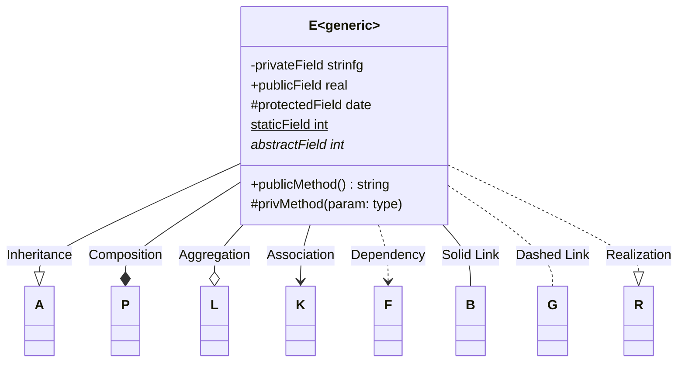

```mermaid
classDiagram

class E~generic~ {
    -privateField strinfg
    +publicField real
    #protectedField date
    staticField int$
    abstractField int*
    +publicMethod() string
    #privMethod(param: type)
}

E --|> A : Inheritance
E --* P: Composition
E --o L: Aggregation
E --> K: Association
E ..> F: Dependency
E -- B: Solid Link
E .. G: Dashed Link
E ..|>R: Realization
```
