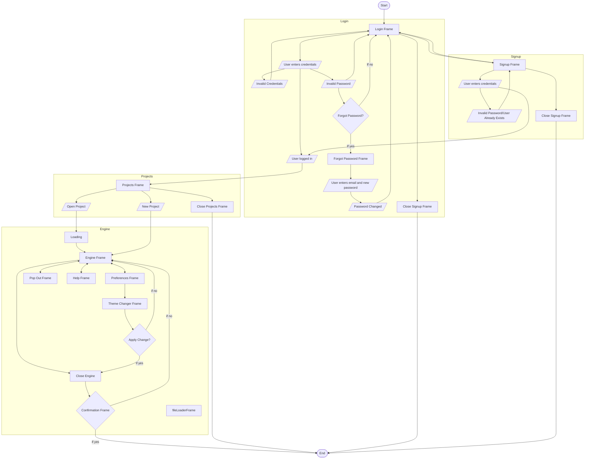

d

e([round node])
s[statement]
st[/input/]
d{d}

```mermaid
flowchart TD;

St([Start]) --> showL[Login Frame]
End([End])

subgraph Login
showL ---> userEnter[/User enters credentials/]
userEnter --> st[/User logged in/]
userEnter --> ic[/Invalid Credentials/] --> showL
userEnter --> ip[/Invalid Password/] --> showL
ip --> fp{Forgot Password?}
fp -->|If no| showL
fp -->|If yes| fpp[Forgot Password Frame]
fpp --> fppCred[/User enters email and new password/]
fppCred --> fppc[/Password Changed/]
fppc --> showL
showL -->closeL[Close Signup Frame]
end

subgraph Signup
showL ---> showS[Signup Frame]
showS ---> showL
showS --> userCS[/User enters credentials/]
userCS --> ipU[/Invalid Password/User Already Exists/]
ipU --> showS
userCS ---> st
showS --> closeS[Close Signup Frame]
end

subgraph Projects
direction TB
projects --> of[/Open Project/]
projects --> np[/New Project/]
projects --> closeP[Close Projects Frame]
end


subgraph Engine
direction TB

engine[Engine Frame]
loading[Loading]
ays{Confirmation Frame}
preferences[Preferences Frame]
themeChanger[Theme Changer Frame]
applyTheme{Apply Change?}
popOutFrame[Pop Out Frame]
closeEngine[Close Engine]
helpFrame[Help Frame]
fileLoaderFrame

of --> loading --> engine
np --> engine

engine <--> preferences
preferences --> themeChanger
engine <--> popOutFrame
closeEngine --> ays
engine --> closeEngine
themeChanger --> applyTheme
applyTheme -->|if yes| closeEngine
applyTheme -->|if no| engine
engine <--> helpFrame

end
st --> projects[Projects Frame]
ays -->|if yes| End
ays -->|if no| engine
closeP --> End
closeL --> End
closeS --> End
```
