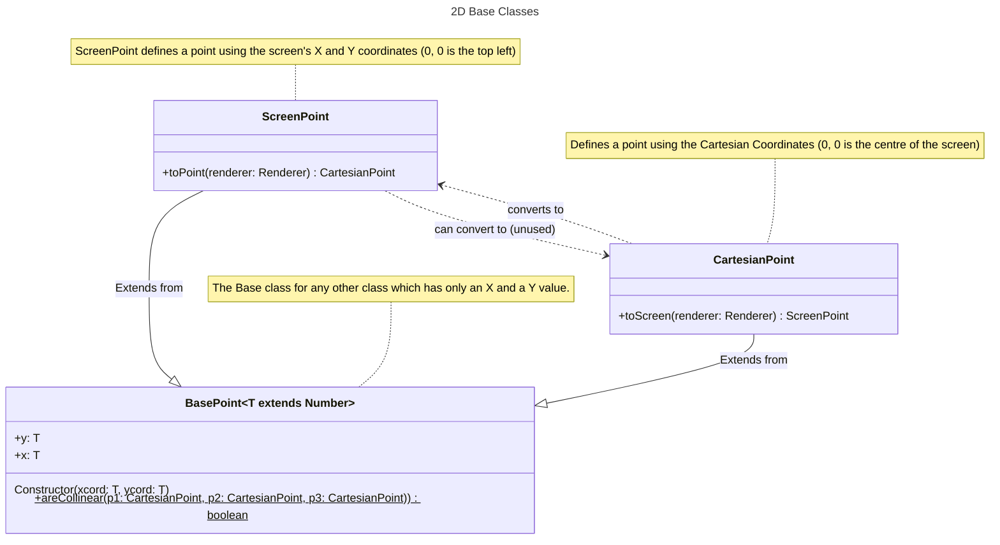
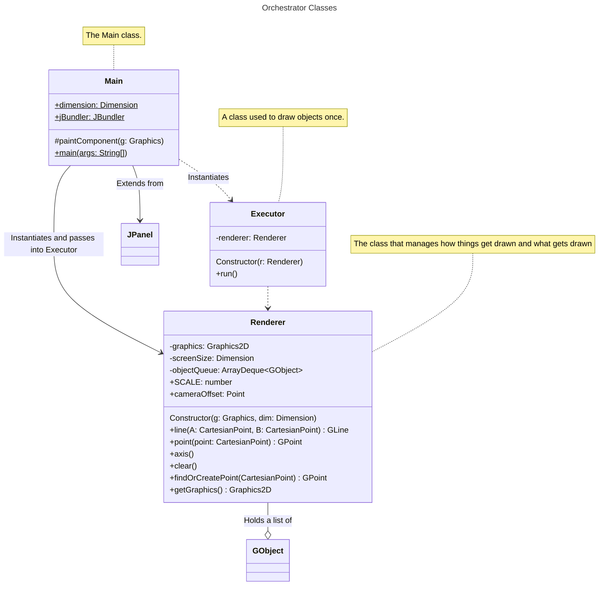

# Implementation Notes and Ideas.

This file is meant to document my progress within this PAT.
It was created 01/10/2025 so
any progress I made before, will be described from the git commit made on 
that day, and then from today I will properly start.

(Any graphs in this file are rendered using Mermaid. Either open the file in Github, 
or in a text editor that supports mermaid syntax in markdown files)

## Progress

### 26 Aug 2024

[Commit on Github](https://github.com/yetnt/j3engine/commit/f65cbb9f4f1d30827d1d0c0279c6bb870f99bc92)

The initial commit. With the project goal, the Main class and the Engine class.

From here, the plan was to get a working 2d shape drawer before even touching 3D.

### 28 Aug

[Github Commit](https://github.com/yetnt/j3engine/commit/eb4dd7fefd8f142904b29ca8815614fb187c4d1d)

This commit features many new classes implemented: Mostly the core of the engine itself.

The following base classes appeared:

Which intend to be used during conversion between cartesian coordinates and swing's
screen coordinates with the following formula

where $S$ is the scale used to define how far CartesianPoints are from each other. $c_{xy}$ is the cartesian point coordinates,
$s_{xy}$ is the screen coordinates, and $f_{height} \times f_{width}$ is 
the frame height and width

$$
s_x = S \cdot c_x + \frac{f_{width}}2
$$

$$
s_y = \frac{f_{height}}2 - S \cdot c_y
$$

Then the 3 most important classes

Which manage everything from rendering, redrawing. Then the shapes themselves

And other classes which aren't of importance to the implementation such as `Point3D` which
holds only a public x, y and z value. And `Dimension` which holds a width and height.

Classes such as `Arrays` and `Testing` came as a result of trying to embed 
[jaiva](https://github.com/yetnt/jaiva) (my custom programming language) into 
this engine. (Which is where the `JBundler` instance comes from) They aren't used in
the main run of the engine and probably won't be until the engine is stable enough.
Therefore until then, No class diagrams will be shown for them.

Also the `Frame` class, came as I thought i will maybe later save stuff as frames from
the engine, but then i realized i'm biting more than I can chew, so I deleted it in later commits.
As it's never used, it won't be documented here either.

Another class implemented for the first time is the `Events` enum, which serves
no purpose in the current commit and therefore will not be part of the class diagrams
(as yet).

---

The core idea before making any GUI was to have a set of base shapes to be able
to draw anytime.

Where `Renderer` holds the master-list of objects to draw anytime the frame needs
to be redrawn and `Main` handles the input and registers the classes. `Executor` is
nothing but debug class used to draw specific shapes at specific coordinates. It may
be removed when the engine is stable with proper GUI.