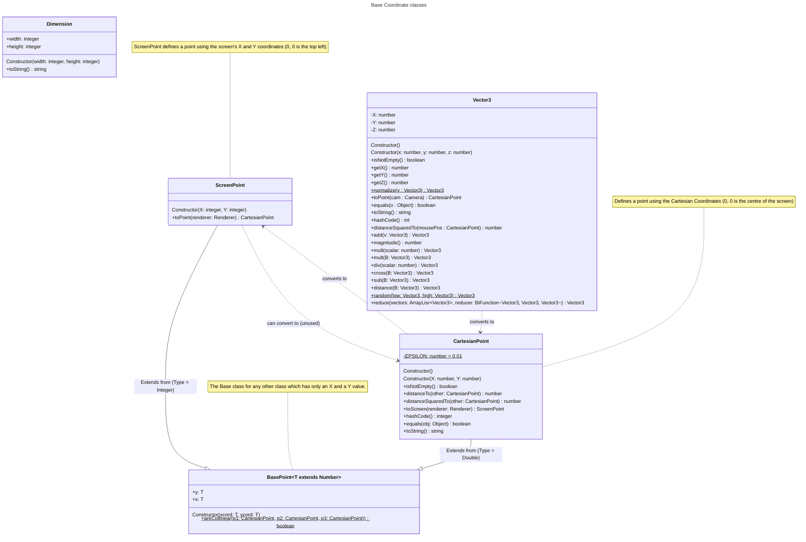
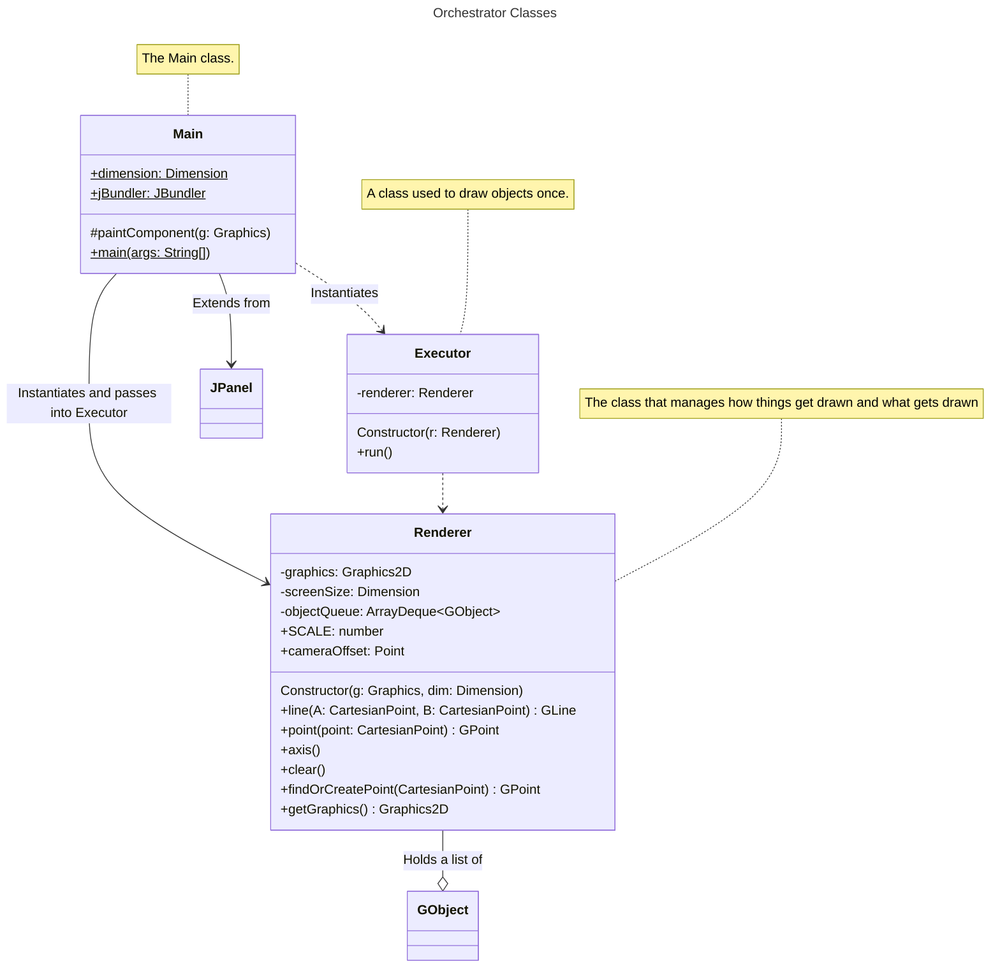
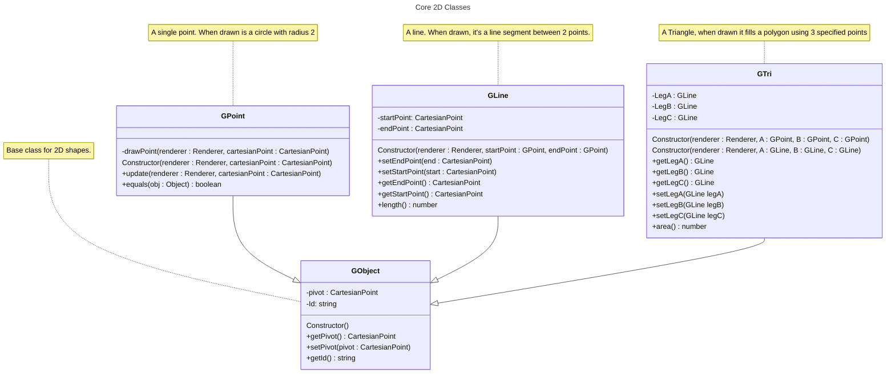
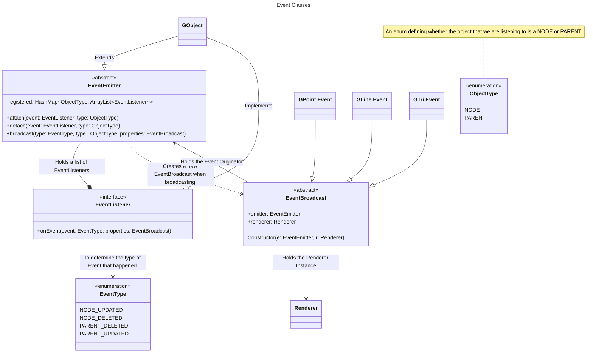
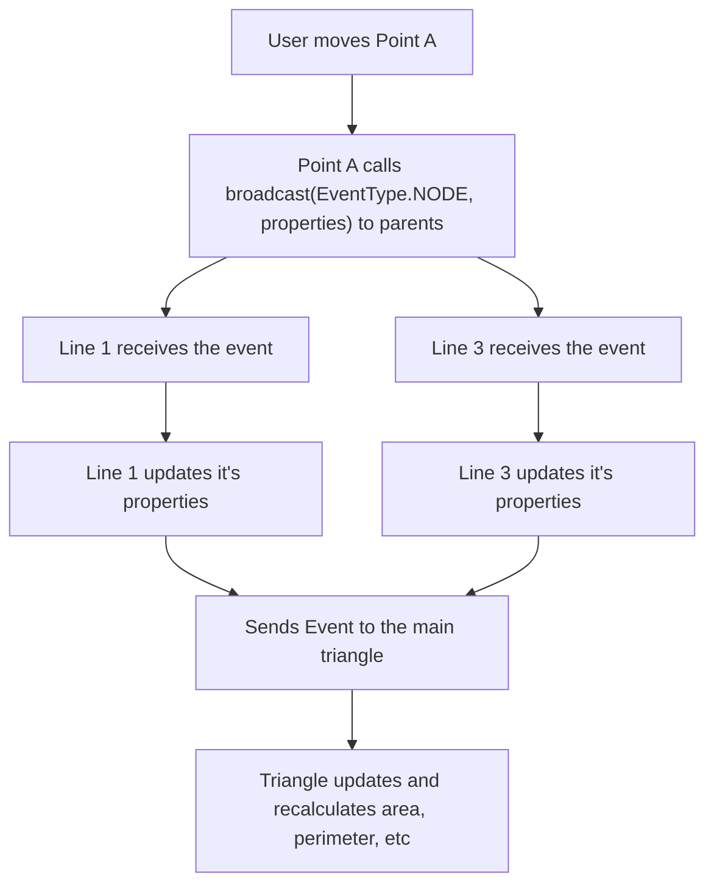
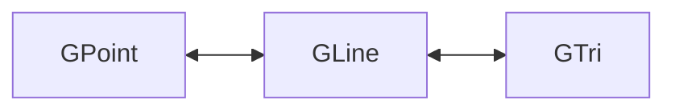

# Implementation Notes and Ideas.

This file is meant to document my progress within this PAT.

After unwrapping and revealing the entire engine, it is wrapped around `Vector3`, `ScreenPoint` and `CartesianPoint`

Where `BasePoint` (should be) an abstract class that holds an X and Y value, which `ScreenPoint` and `CartesianPoint` extend off.

The core of 3D Graphics is projecting a 3D object onto a 2D screen. How `Vector3` becomes a `CartesianPoint` is not simple.

(See [Wikipedia's Article on 3D to 2D Projection](https://en.wikipedia.org/wiki/3D_projection))

The method this engine uses is Perspective Projection, where objects further away from the camera appear to be smaller When in reality they could be the exact same size.

[This exact formula](https://en.wikipedia.org/wiki/3D_projection#Mathematical_formula) from Wikipedia is used for this conversion.

After converting it to a `CartesianPoint`, we need to convert it to Swing's coordinates. as a Cartesian Point's coordinates originate at the centre of the screen and
Swing's is the top left corner of the frame. This is done using the following formula (`ScreenPoint` represents the coordinates Swing uses.)

where $S$ is the scale used to define how far CartesianPoints are from each other. $c_{xy}$ is the cartesian point coordinates,
$s_{xy}$ is the screen coordinates, and $f_{height} \times f_{width}$ is 
the frame height and width

$$
s_x = S \cdot c_x + \frac{f_{width}}2
$$

$$
s_y = \frac{f_{height}}2 - S \cdot c_y
$$

Which manage everything from rendering, redrawing. Then the shapes themselves

And other classes which aren't of importance to the implementation such as `Point3D` which
holds only a public x, y and z value. And `Dimension` which holds a width and height.

Classes such as `Arrays` and `Testing` came as a result of trying to embed 
[jaiva](https://github.com/yetnt/jaiva) (my custom programming language) into 
this engine. (Which is where the `JBundler` instance comes from) They aren't used in
the main run of the engine and probably won't be until the engine is stable enough.
Therefore until then, No class diagrams will be shown for them.

Also the `Frame` class, came as I thought i will maybe later save stuff as frames from
the engine, but then i realized i'm biting more than I can chew, so I deleted it in later commits.
As it's never used, it won't be documented here either.

Another class implemented for the first time is the `Events` enum, which serves
no purpose in the current commit and therefore will not be part of the class diagrams
(as yet).

---

The core idea before making any GUI was to have a set of base shapes to be able
to draw anytime.

Where `Renderer` holds the master-list of objects to draw anytime the frame needs
to be redrawn and `Main` handles the input and registers the classes. `Executor` is
nothing but debug class used to draw specific shapes at specific coordinates. It may
be removed when the engine is stable with proper GUI.

#### Add README commit

[Commit](https://github.com/yetnt/j3engine/commit/eb4dd7fefd8f142904b29ca8815614fb187c4d1d)

Added the basic readme

### 29 Aug

#### Add Documentation

[Commit](https://github.com/yetnt/j3engine/commit/94bfa4b6ed1fd3d1041aabc33185e9ff873e9745)

Started documentation on the core classes and deleted the 
`Engine` and `Frame` class as they served no use.

#### Event Management

[Commit](https://github.com/yetnt/j3engine/commit/835a05b6334ab763373ccb28eade8866ede342a2)

Started work on Events.

How this was thought out was: When drawing, a point may update and a line or triangle
needs to react to said update and update themselves. Or if a triangle gets deleted, 
the lines (nodes) need to delete themselves.

The main idea is that if an object, such as a `GLine` has 2 `GPoint`s, those points
are **nodes** to the `GLine`, while the `GLine` is the **parent** to each `GPoint`

`GPoint`, `GLine` and `GTri` each have their own `Event` class which 
extend `EventBroadcast` which other `G`Objects should listen for. 

How The Event happens and propagates is the following:

Assuming you have the `GTri` **tri** with **3 lines** (`GLine`s) sharing
3 `GPoint`s respectively, such that:

**A** connects to **B** to form **Line1**, **B** connects to **C** to form **Line2**
and **C** connects to **A** to form **Line3**.

As Shown in the diagram, the main expected Event Propagation is:

Where the only initiators of events, are the ends `GPoint` and `GTri`. A `GLine` being in the middle,
shouldn't be able to initiate events. They propagate events up and down, but never
start one.

### 30 Aug

[Events](https://github.com/yetnt/j3engine/commit/cf36183b65f78a818da71c8ae4f3a46dadd64f22)

This adds the `ObjectType` enum shown in the above diagrams.

### 19 Sept

#### Events and Stuff

[Commit](https://github.com/yetnt/j3engine/commit/bef120b329c27e3f9a03535da65daa17d4b02120)

Implements events into GObjects and adds `registeredNodes()`, 
`registeredParents()` and `detachAll()` to `EventEmitter`.

Also marks the `registered` HashMap as protected.

#### GUI

[Commit](https://github.com/yetnt/j3engine/commit/45b12ded306492d004c18b434263a8415ce2b498)

Begin implementing the Debug GUI with a basic `draw` and `clear` button.

