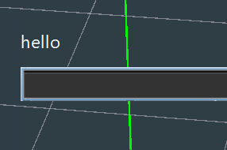

# Commands

Commands are a powerful way to use the engine. A command invokes some operation/state when it itself is invoked and can
be invoked by the user directly through the command palette or by the user via a GUI abstraction.

# Command Properties

## Alias

A different label for the exact same command. Technically, the name of the command is defined in the code
as it's first alias but it functions the exact same.

---

Aliases provide a short convenient way to refer to a command without having to remember it's full name.

---

e.g. the command **`transform`** can be invoked via that name or one of it's aliases: 
**`trans`**, **`tr`**

---

below is an example of the [typing hints](#typing-hints) showing all the aliases for the same **`transform`** command

 </img>

## Arguments

Commands, have what's called **arguments**. These are positional input that the command expects to receive and work
upon.

An example would be

```cmd
prism (0, 10, 0) (0, 20, 0) plane:"XY"
```

**prism** is the command name whereas **_(0, 10, 0)_** is the first argument to the prism command, and etc.

---

`plane:"XY"` is a tagged argument. That will be discussed in detail later.


## Stateful vs Stateless

### Stateless

A _stateless_ command is any command which is purely immediately side effects. In 
that it will run and then finishes, not retaining any state for future invocations.

---

An example would be a **`print`** command, which simply prints its arguments to the console and then closes.

---

Here is an example after executing the following command

```cmd
debug echo "hello"
```

 </img>

Simply prints hello and continues allowing user input.

### Stateful

A _stateful_ command on the other hand, takes over user input and is usually noticeable due to the fact that 
most other operations or commands cannot execute until the current one has finished. These are identifiable
as they usually tell you to give input via **_`ESC`_** to exit the command, or **_`ENTER`_** to commit whatever
the command is showing.

# Typing Hints

Typing hints are a feature of the command palette that helps you discover and correctly use commands. As you type, the command palette will suggest commands and arguments that match your input.

---

Using the same image as before

 </img>

here we see the 3 aliases for the `transform` command provided by the typing hints.
