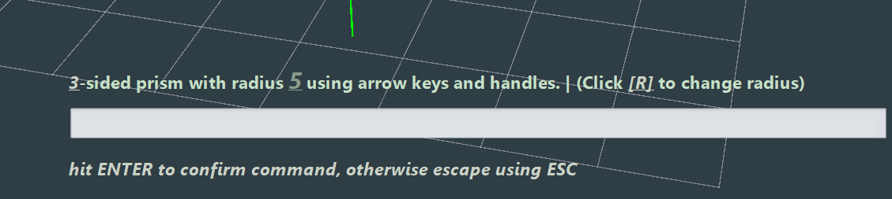

# Commands

Commands are a powerful way to use the engine. A command invokes some operation/state when it itself is invoked and can
be invoked by the user directly through the command palette or by the user via a GUI abstraction.

# Command Properties

## Alias

A different label for the exact same command. Technically, the name of the command is defined in the code
as it's first alias but it functions the exact same.

---

Aliases provide a short convenient way to refer to a command without having to remember it's full name.

---

e.g. the command **`transform`** can be invoked via that name or one of it's aliases: 
**`trans`**, **`tr`**

---

below is an example of the [typing hints](#typing-hints) showing all the aliases for the same **`transform`** command

 </img>

## Arguments

Commands, have what's called **arguments** . These are positional input that the command expects to receive and work
upon.

An example would be

```cmd
prism (0, 10, 0) (0, 20, 0) plane:"XY"
```

**prism** is the command name whereas **_(0, 10, 0)_** is the first argument to the prism command, and etc.

</img>

---

`plane:"XY"` is a tagged argument. That will be discussed in detail later.

---

Things such as [Typing hints](editing.j3.md#typing-hints) show syntax such 
as **<.vector3>** to show that an input such as above is required. here is a list
of arguments which any command may want to take.

### Typed Arguments

These arguments usually have the form of **<required type>** and are usually in bold.

---

Arguments which have a **?** at the end mean they are optional and not required. These arguments are usually
in italics and unlike the required arguments are not in bold.


#### string

This denotes that the expected argument takes in a string, the command parser can most time infer that you're inputting
a string without double quotes however it's best to always have double quotes. (especially if you need spaces in the string)

---

a usage string such as

```
echo <string>
```

expects you to type

```
echo "hello"
```

or using anything, as long as its in quotes

```
echo "my very long string with spaces"
```

#### number

This denotes that the expected argument takes in a number. It can be either an integer or a real number

---

```
calculate-add <number> <number>
```

can take input such as

```
calculate-add 10 23.4
```

#### integer

This denotes that the expected argument takes in an integer.

---

```
set-size <integer>
```

can take input such as

```
set-size 10
```

#### boolean

This denotes that the expected argument takes in a boolean value, which can be either 
`true`, `yebo` (which both map to a **yes** value) or `false`, `aowa` (which both map to a **no** value).

---

```
set-visibility <boolean>
```

can take input such as

```
set-visibility true
```

#### colour

This denotes that the expected argument is specifically of a colour format. Colour formats can come in
multiple ways which include:

---

in an `#R:G:B#` or `#R:G:B:A#` format, where R, G, B, and A are integers between 0 and 255 representing the Red,
Green, Blue, and Alpha respectively.

---

or in the `#(Hex Code)#` format, like `#a3f5cd#` (Mixed caps accepted)

```
prism <colour> <colour> <colour>
```

can take input such as:

```
prism #100:23:243# #FFFFFF# #62:210:78:30#
```

#### point, ine, tri, curve, thing

These denote that a **UUID** which references that specific geometry needs to  be input into the command.
UUIDs usually look like long strings of text e.g. `d2c2e0b1-4f8e-4a7b-9c0d-1a2b3c4d5e6f` and are used
by the engine to uniquely identify any geometry or `Thing` . These UUIDs can be found within the
[Properties Panel](editing.j3.md#properties) and should eb pasted in directly without quotes or else it will be treated
as a string

```
join line <point>
```

can take input such as (given the UUIDs exist)

```
join line d2c2e0b1-4f8e-4a7b-9c0d-1a2b3c4d5e6f
```


#### Vector3

This denotes that the expected argument takes in a list of 3 numbers in parentheses, separated by a comma.
This is known to the engine as a [Vector3](maths.j3.md#vector3) and can either represent in arbitrary 3D
position or a direction (depending on the command).

---

a usage string such as

```
prism <vector3>
```

expects you to type

```
prism (0, 0, 0)
```

however you replace the numbers with any integer or real number you wish.

#### any

This denotes that the expected argument can be of any type. The command parser will attempt to infer the 
type (e.g., string, number, boolean, point, line, tri, curve, Thing, Vector3, Colour) based on its format.

---

a usage string such as

```
set-property <any>
```

expects you to type

```
set-property "some text"
set-property 123
set-property true
set-property (1, 2, 3)
```

any input is valid input provided it is **<any>**

### Argument Sets [a|b|c]

This is a special case of below, where the command technically does take a string but it only takes in a specific
string from a pre-defined set.

---

An example set would be **[plane|triangle|face]** where you have to put one of those words or else the argument
is invalid.

```
ui toggle [properties|layer|grid|history]
```

can take

```
ui toggle properties
```

or

```
ui toggle layer
```

### Tagged Arguments

These arguments (shown in the end of command usages as **_...key:value_** ) come in the form of
`key:value` or `key=value` .

---

These arguments are **not** positional, meaning they can go in any position of a command.

```cmd
debug typeof 10 string:"hello"
```

is the exact same as

```cmd
debug typeof string:"hello" 10 
```

or even

```cmd
debug string:"hello" typeof 10 
```

but not before the command name.

---

Most commands expect specific
tagged arguments. Such as the explode command which makes explicit use of tagged arguments

```cmd
explode thing:"My Thing"
```

There are specific tagged arguments which exist that can be input, you can't just put whatever. The command palette
will report to you about them and errors since most tagged arguments expect specific types.


## Stateful vs Stateless

### Stateless

A _stateless_ command is any command which is purely immediately side effects. In 
that it will run and then finishes, not retaining any state for future invocations.

---

An example would be a **`print`** command, which simply prints its arguments to the console and then closes.

---

Here is an example after executing the following command

```cmd
debug echo "hello"
```

 </img>

Simply prints hello and continues allowing user input.

### Stateful

A _stateful_ command on the other hand, takes over user input and is usually noticeable due to the fact that 
most other operations or commands cannot execute until the current one has finished. These are identifiable
as they usually tell you to give input via **_`ESC`_** to exit the command, or **_`ENTER`_** to commit whatever
the command is showing.

---

here is the _prism_ command, which is a stateful command in that you need to give input
and explicit hit ENTER or ESC to leave.

</img>