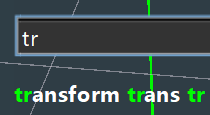
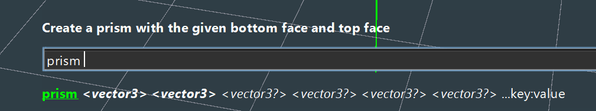

# Editing

## Properties

## Command Palette

# Typing Hints

Typing hints are a feature of the command palette that helps you discover and correctly use commands. As you type, the command palette will suggest commands and arguments that match your input.

---

Using the same image as before

 </img>

here we see the 3 aliases for the `transform` command provided by the typing hints.

---

then below we have the _prism_ command with the arguments it takes in

</img>

---

