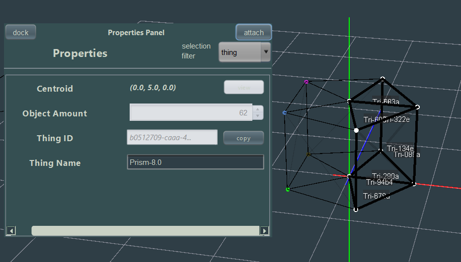

# Editing

Most of editing can be done via the [Toolbox](getting-started.j3.md#toolbox) or
[Context Menu](getting-started.j3.md#context-menu) . But commands will be referenced if you prefer them.

## Properties

Accessible via the [Toolbox](getting-started.j3.md#toolbox) , the properties panel
allows you to view the properties of a selection of objects

</img>

The properties panel (in default mode) will try to aggregate multiple similar properties into
a single one for a selection of multiple objects, and further more only show the intersection
of properties between multiple different objects.

---

You can make the properties panel filter for specific objects in the selection by changing the
**default** combo-box to which-ever property you want to explicit filter for.

---

Some properties cannot be edited in bulk, while others can. You may need to precisely select
what you'd like to edit in order to apply your edits.

## Transforming

There are multiple ways you can transform geometry in J3Engine.

---

**Translate/Rotate/Scale** - The 3 most common terms for "transform" which use handles
and arrow keys to apply said transformation. This is accessible either via `transform` command
or the toolbox on a selection of objects

---

**QuickTranslate** - A command that allows you to quickly translate a selection of objects
without using arrow keys and just the mouse alone.

---

**Join/Explode** - Join is a common that allows you to connect either 2 points into a line or 3 points
into a [Bézier curve](https://en.wikipedia.org/wiki/B%C3%A9zier_curve) . Explode is the opposite which
destroys geometry into points.

---

**Extrude** - A command which allows you to "pull" a triangle into becoming a 3d solid.

## History

A lot of engine stuff save to history (also a panel in the toolbox) which you can undo and redo at\
any time by either going to the Top Right at Edit > Undo/Redo. Or using **CTRL+Z** and **CTRL+Y**

---

Most features aren't completely within history yet, so it's advised to save backups of your
files.

# Command Palette

## Keybinds

**UP/DOWN** (arrow key) - These keys allow you to travel through the history of commands that have already
been executed allowing fast execution instantly

---

**RIGHT** (arrow key) - Attempts to autocomplete an incomplete [Command Alias](commands.j3.md#alias)
or [Argument Set](commands.j3.md#arguments) This is useful in the event you do not want to type the entire
string out.

---

**ESC** - Removes focus from the command palette back into the scene so you do not type in
the command palette anymore

---

**ENTER** - Attempts to execute whatever you ahve currently typed in the command palette as a
command. Usdually [typing hints](#typing-hints) will hint at you whether this is valid or not but
you can further continue for the command to confirm that its invalid usage.

## Typing Hints

Typing hints are a feature of the command palette that helps you discover and correctly use commands. As you type, the command palette will suggest commands and arguments that match your input.

---

Using the same image as before

 </img>

here we see the 3 aliases for the `transform` command provided by the typing hints.

---

then below we have the _prism_ command with the arguments it takes in

</img>

