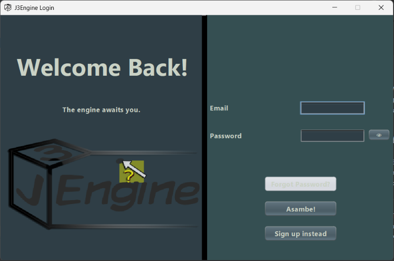
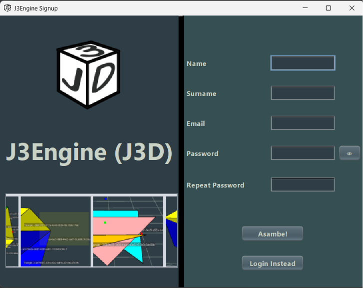

# Getting Started

</img>

Welcome to the J3Engine! Where you're given the freedom to play
around with (almost) any parameter!

---

For more information about J3Engine visit [About](about.j3.md) or [Design](about.j3.md#design)

## Authentication

Before you pass through you need to either log in to an existing account
or create one.

---

The engine will greet you with the login page on startup. If you do not
have an account then see [Signup](#signup)

### Login

</img>

To log back into your account, simply enter the email you used to log
in and the matching password.

---

If you have forgotten your password, you can try up to 5 times before
a button (currently greyed out in the screenshot) will allow you
to reset your password. Otherwise create a new account
---
Once you've got in, click Asambe to begin!

### Signup

</img>

Gives you the form to fill out to signup.

---

We do care about your account safety, hence simple password sequences or
common passwords will not be accepted.

---

Once you've got in , click Asambe and you should be taken to the
projects page

## Projects
