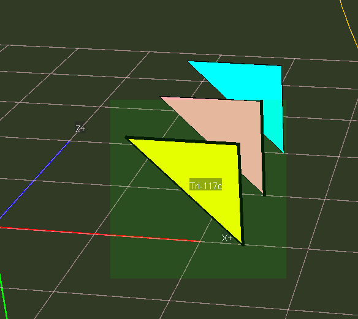
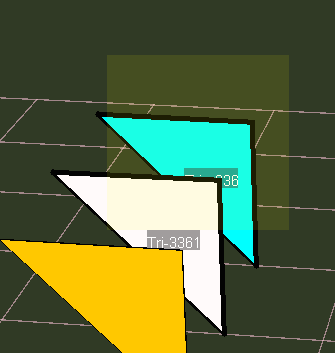
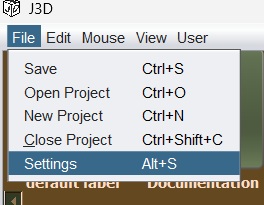
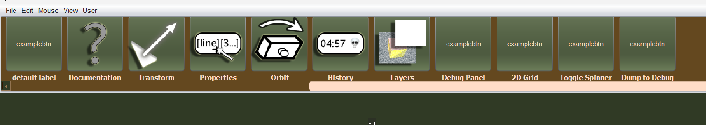
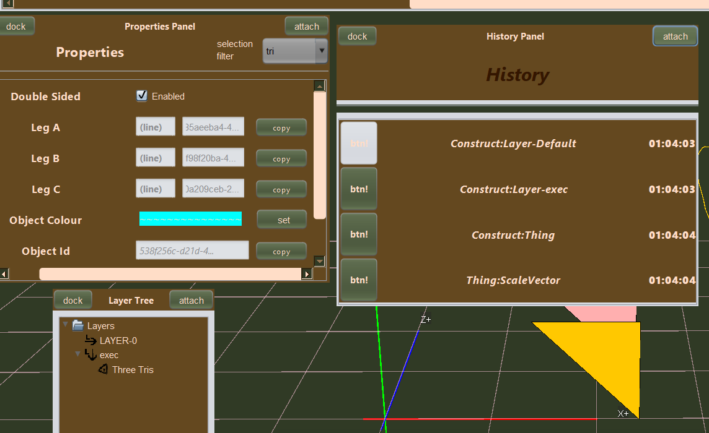
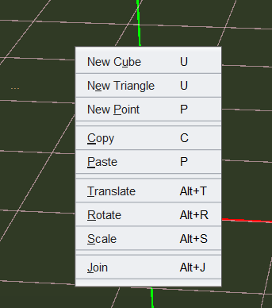
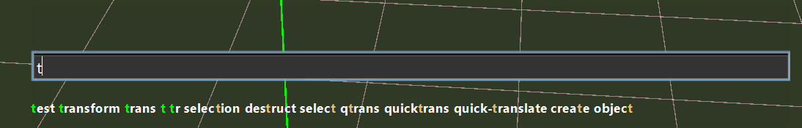
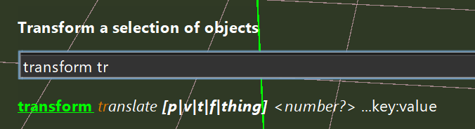
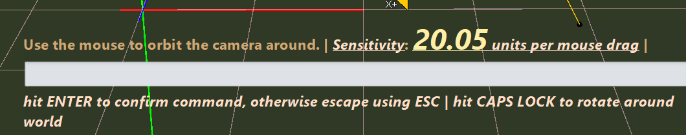

# Getting Started

</img>

Welcome to the J3Engine! Where you're given the freedom to play
around with (almost) any parameter!

---

For more information about J3Engine visit [About](about.j3.md) or [Design](about.j3.md#design)

## Explanation

### Scene Graph

Everything within the scene is sorted into specific categories. A triangle, line or point is usually referred to
as an object and multiple objects can be stored within a singular entity called a `Thing`. And furthermore a `Layer`
stores multiple `Things`. This is just the introduction to the organisation of the engine mostly you don't
need to worry about these.

### Camera

Since this is a 3D Engine, you have a view commonly referred to as your `camera`, it allows you to actually view the scene.
The most used operation is rotating your camera around the scene, by either using the `Orbit` button in the [Toolbox](#toolbox)
 or by running the following command in the [Command Palette](#command-palette). you can also double click the 
following block to enter it into the command palette for you.

```cmd
camera orbit
```

You can also use `W`, `A`, `S` and `D` controls to physically move the camera beyond rotation. Also `Q` and `E` for up
and down.

### Commands

The core of the entire engine is that, everything you can do is something you can execute via the [command palette.](#command-palette)
Usually commands are for power users but you can type out anything within the command palette to discover any
command or command logic. The typing hints can help. Otherwise you can also double click the following command
and hit enter

```cmd
help
```

Commands are typed out and need you to explicitly hit enter to invoke them. The most used operations however
are available via the [Toolbox](#toolbox) and the [Context Menu](#context-menu)

---

For more on commands see [Commands](commands.j3.md)


### Selection

You can click and drag your mouse to show squares. These are selection squares for when
you have objects to select.

---

Standard selections are applied by doing this click and drag motion. Dragging down will show a yellow box and anything
intersecting will be selected. Dragging up shows a green box and only objects which are contained within the square will
be selected.

</img>

</img>

---

Along with this, you can use `I` to add to an existing selection or `U` to subtract from an existing selection.
Most commands require a selection first.

## Your first Thing

### Simple

Right click to open the [Context Menu](#context-menu) and click `cube` to create the default grey cube.

### Advanced

enter the command palette (or click on your keyboard `/`) and type out the following command or otherwise double click
the example block to enter it into the command line for you.

```cmd
prism (0, 0, 0) (0, 10, 0) plane:"XZ"
```

and hit enter. A default prism will appear. Then you can select it via the logic defined in [Selecting](#user-interaction)
and follow the next step.

### Transforming

Once you have something you can either use the [Toolbox](#toolbox) or [Context Menu](#context-menu) to use the 
transform commands. or otherwise call the commands directly.

---

Example command to call (select something first)

```cmd
transform translate p
```

The transform commands use the arrow keys to move stuff around, and when you click the coloured gizmo instead, 
uses the `UP` and `DOWN` keys only. Most transforms also provide a `R` key which cycles through preset values for moving. You can still
use the camera movement keys to move around although you cannot orbit. Once you're happy with a transform, you can
hit `ENTER` to save it, or `ESC` to revert it back to where it was. And if you further dont like it afetrward you can
hit `CTRL+Z` to undo, and the inverse `CTRL+Y`

---

If you aren't doing complex translations, you can quickly move something by using

```
quick-translate
```

## Saving

Once you're happy, you can hit `CTRL+S` to save your project and when you open the engine again
(provided nothing broke) you can find the project right there immediately!

---

This saves files in the `.j3p` format which is not readable via a text editor as it
stores binary data.

## UI

### Menu Bar

The usual `File` `Edit` bar is available for some actions. One useful action is
going to `View` and changing it to wireframe mode to also render points and all hidden
geometry.

</img>

### Toolbox

The toolbox is the topmost bar with buttons that do various things. These are usually interactions or panels

</img>

---

The most important panel is most probably the `Properties` panel which allows you
to view the properties of objects with the given selection. There is also the
`Layer` `Tree` panel which lets you view the entire scene graph.
(Only the layers and things however). And another important one is the `History`
panel which allows you to undo and redo to specific times.

</img>

### Context Menu

The context menu can be triggered by right clicking the view at anytime.
Currently it just serves as a quick way to do a few commands other than typing or
or clicking the toolbox button.

---

The mnemonics work, but the accelerators don't

</img>

### Command Palette

The most UX heavy feature of the engine, the toolbox which allows you to type and enter
commands explicitly without the help of UI. Commands have a given name with multiple
different aliases that still execute the same command, allowing you to remember a
shortened name of a command

---

The following image shows the command palette with input being typed into it and showing
the commands that match.

</img>

The following, the arguments the `transform translate` command takes

</img>

And finally, the command palette showing what it shows when you enter `orbit` via the following

```cmd
camera orbit
```

</img>


# What's next

For now this document is finished, it will grow in size, however. This is jsut the pure basics
to get you started! More to come!